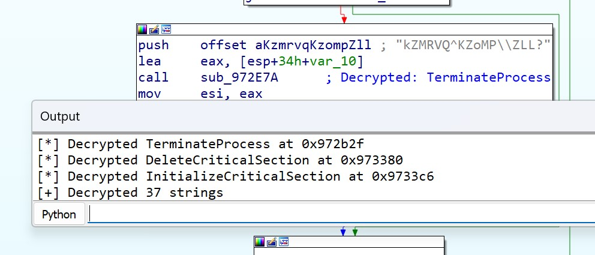

# ShadowPad

## unpack_sc.py

IDAPython script that unpacks shellcode from ShadowPad loader.

MD5 hash of tested loader DLL file: `9d686ceed21877821ab6170a348cc073`

## repair_broken_jumps.py

IDAPython script that repairs broken jump instructions (because of obfuscation) in disassembled code.
Change `START_EA` address (the address of start of obfuscated code) depending on the sample.

## calc_hash.py

Python script that obtains DLL filename and API function name from hardcoded hash value in ShadowPad shellcode.

## unpack_next_sc.py

IDAPython script that unpacks next (third stage) shellcode from ShadowPad shellcode.

**TODO: Super dirty code. Needs to be refactorized.**

Better way to unpack using debugger

I have wrote this manual unpacker as a practice (& fun) of RE, but it is not accurate, so I will recommend to use debugger (like x32dbg) to extract next-stage shellcode.
This is way more easier and good for most people.

1. Set breakpoint on `VirtualAlloc` function and `call edi` instruction at the end of shellcode.
2. Once debugger reaches breakpoint of `VirtualAlloc` function, follow its result (allocated memory) in Dump.
3. Once debugger reaches breakpoint of `call edi` instruction, dump the allocated memory to the file.
4. Open up dumped memory in IDA (or any other disassembler) and set offset to address of allocated memory.

## string_decrypt.py

IDAPython script that decrypts XOR-encrypted strings inside the third stage shellcode.

## decrypt_code_from_stage3.py

Decrypt embedded payload inside third stage shellcode, and outputs as `decrypted_code.bin` file.
